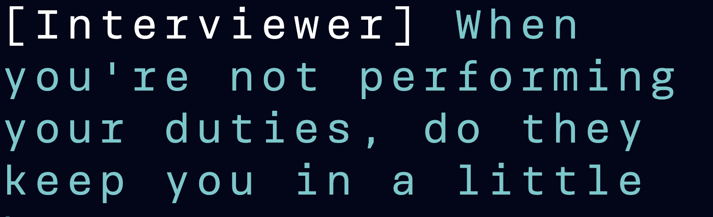

# Kaya Skov, Web Typography, 2019/2020

## Link naar eindresultaat
https://kayaskov.github.io/web-typography-19-20/closed-captions/

## De opdracht
Maak voor Darice een nieuwe soort closed captions die ook de sfeer van de rest van het geluid overbrengt. Darice is door en krijgt door de normale closed captions vaak niet genoeg context mee. Zo mist ze belangrijke dingen in het plot. Ontwerp daarom de typografie van de closed captions, de geluiden in de film en andere context elementen zodat Darice dit begrijpt.

## Kennismaking met Darice
Meteen na de eerste les heb ik kennis gemaakt met Darice. Zo leerde ik dat ze niet perse van een genre houd en van alles leuk vindt als het om films en series gaat. Ook houd ze van koken en planten. Verder is Darice dus doof geworden op latere leeftijd dus ze weet wel hoe het is om te kunnen horen. Zo heeft ze vaak bij films dat ze zelf geluid erbij "hoort" in haar hoofd die ze zou verwachten. In een drukke gang hoort ze bijvoorbeeld geroezemoes en stappen en buiten hoort ze toeterende auto's. Dat kan in mijn voordeel werken. Voor de hand liggende geluiden hoeven zo niet expliciet ontworpen worden.

De eerste keer dat ze het fragment zag snapte ze er niets van dus: werk voor de boeg!

### Qua ontwerp voorkeuren was ze duidelijk fan van:
* Neon kleuren
* Visualisatie van geluiden
* Een naam bij de tekst
* Verschil in vormgeving per stem

## Typografie
Omdat Darice zelf aan gaf dat ze typografisch onderscheid tussen personen fijn vond ben ik hier mee aan de slag gegaan. Elke stem heb ik apart bekeken en ontworpen zoals ze over moesten komen. Ik heb er voor gekozen om grote, goed leesbare ,letters te doen om eens af te wijken van de standaard en te kijken wat dit zou doen. Ook koos ik voor het Brenner font zodat ik verschillende stijlen kon gebruiken.

### Voice Stip

Voor Darice was het lastig om te zien waar de stemmen vandaan kwamen. Hiervoor heb ik een experiment bedacht. Ik heb een stip gezet bij het object waar het geluid vandaan kwam. Wanneer deze van buiten het scherm komt staat hij buiten het scherm links bovenin. De stip is groter wanneer hij buiten het beeld staat omdat als je focused op te film moet wat er buiten staat groter zijn anders zie je het niet. Dit ontdekte ik toen ik ze nog klein had. Wanneer de stem onscreen is is hij kleiner om zo niet te veel van het scherm te bedekken. De stippen bewegen mee met de stem (size) om zo de connectie met de stem te maken. Ook heb ik de stip een witte rand gegeven zodat hij op elke achtergrond goed zichtbaar zou zijn.

In een test moment heb ik Darice hier plaatje van laten zien, haar interesse was gewekt en ze wilde hier meer van zien en ook Vasilis was enthousiast. Het heeft mij super veel tijd gekost dit in mijn code te krijgen  (Thanks Chelsea!) en hierdoor heb ik het niet kunnen testen met Darice. Wel ben ik blij dat ik het experiment heb gedaan en denk ik wel degelijk dat het van toegevoegde waarde is dat ik dit heb gedaan. 

### Voice1 + 4 Interviewer

De eerste stem is de interviewer die K vragen stelt. Zijn stem hoor je door een speaker. Darice vond het fijn als zijn stem een robot achtig font zou hebben. Hier was ik het mee eens omdat de interviewer een kille stem heeft die overeen komt met een robot en doordat hij door een speaker komt wordt dit gevoel versterkt. Om die kille sfeer te versterken heb ik de letters ook een blauwe kleur gegeven. Voor de tweede interviewer heb ik de zelfde kleur gekozen met een onderscheid van de naam ervoor. Het had geen toegevoegde waarde om hier een onderscheid in te maken.

### Voice2: K

De tweede stem is die van de hoofdpersoon: K. Ik kreeg door het begin stukje waar hij uitgescholden wordt door iemand in de gang een beetje medelijden met hem. Door de tekst een hogere fontweight te geven laat ik als eerste zien dat hij de hoofdpersoon is en als tweede zien dat hij toch sterk in zijn schoenen staat. Door de kleur oranje te gebruiken geef ik wat warmte mee en het contrasteert ook lekker met de donkerblauwe achtergrond voor meer leesbaarheid. Hierbij heb ik ook nog een stippellijn toegevoegd. Dit omdat het hij het hele frame een soort van ondervraagd word en zijn antwoord (wat hij zegt) dan op de stippellijn komt.

### Voice3: Soldaat in de gan

De man in de gang die er uit ziet als een soort soldaat fluistert maar hij doet dit op een agressieve manier. Ook zegt hij Fuck off en scheld hij K uit. Het fluisteren heb ik laten overkomen door het als lucht eruit te laten zien (blauwe kleur + blur), dat het agressief spreekt eigenlijk voor zich door wat hij zegt maar om het duidelijker te maken heb ik de tekst schuin gezet. De tekst staan in beeld omdat het voor mijn geen toevoeging had om het als klassieke caption neer te zetten, het versterkt het verhaal doordat het een deel van het verhaal wordt. 

## Geluiden
Voor de geluiden heb ik er voor gekozen om verschillende animaties met het frame van de video te doen. Zo zijn de WIIEEEHOEE geluiden een witte trillende flits, is de sirene een draaiende lichtgevende animatie en is het alarm een soort van rode scanner. Ook komende de woorden BEEP BEEP in grote gele letters in beeld wanneer een apparaat van de vrouw af gaat. De steeds luider wordende pieptoon op de achtergrond is gevisualiseerd door de filter invert die letterlijk een soort van error effect over de film legt. 

Ik heb er voor gekozen om alleen geluiden die niet voor de hand liggen te animeren omdat Darice aan gaf dat ze zelf in haar hoofd vanzelfsprekende geluiden toevoegt.

## Kleurgebruik

 Voor kleurgebruik heb ik gekozen voor kleuren die uit de poster van de film kwamen. Dit omdat ik mijn toevoegingen bij de film wou laten passen. Darice gaf ook aan dat ze van neon kleuren houdt en hier kwam het ook mee overeen. Ook contrasteren de turquoise kleur en de oranje kleur waardoor het contract optimaal is.

## Feedback van Darice

Tijdens het testen viel mijn tekst buiten het beeld van Darice en sowieso vondt ze te tekst iets te groot dus hierna heb ik de tekst wat kleiner gemaakt.

Ook had ze bij andere al goede dingen gezien bij het stukje waar 3x de zelfde tekst achter elkaar wordt gezegd dus dit wou ze ook nog graag bij mij zien.

## Exclusive design principles

Omdat Darice ooit heeft kunnen horen vult ze zelf sommige geluiden in. Hier is ze anders in dan andere mensen die niet kunnen horen. Dit heb ik in mijn voordeel laten werken door alleen de onverwachte geluiden er in te doen.

Het is standaard om closed caption klein en in zwart wit onderin het beeld te zitten. Ook is dit vaak allemaal in het zelfde font. Ik heb er voor gekozen om verschillende font stijlen te gebruiken + verschillende kleuren + verschillende font weights. Dit omdat Darice uitsprak hier behoefte aan te hebben.

Darice gaaf zelf sterk aan van neon kleuren te houden, hier had ik zelf in eerste instantie niet aan gedacht. Uiteindelijk heeft dit heel goed uitgepakt omdat hierdoor de tekst beter opvalt en ook goed leesbaar is.

De stippen die ik toegevoegd heb zijn  bedacht omdat ik dacht: Hoe kan ik in de meest heftige manier laten zien waar het geluid vandaan komt? Nou door het letterlijk aanwijzen van een object met een Stio. Dit is uiteindelijk een leuk experiment geworden waar ik trots op ben.
